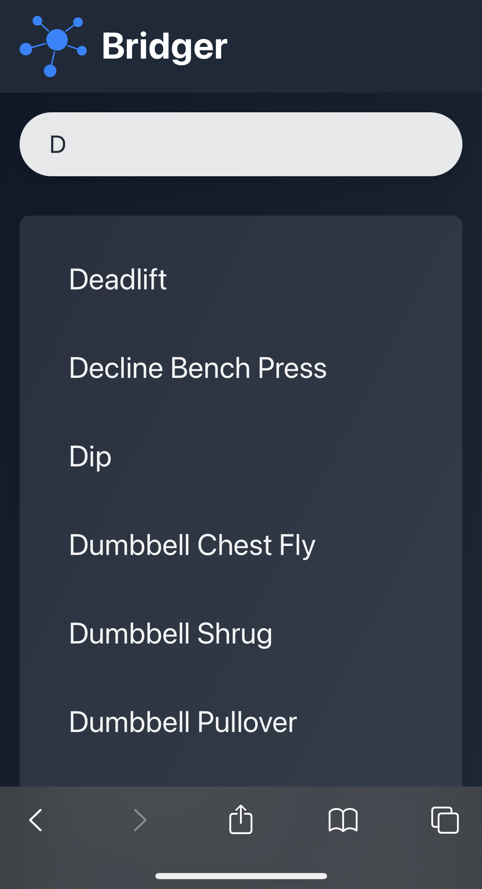
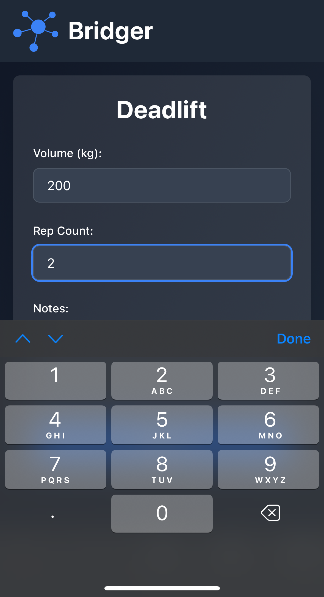

# Bridger: Exercise and Calorie Tracker

[Bridger](https://en.wikipedia.org/wiki/Jim_Bridger) is a modern, efficient exercise and calorie tracking application.

## Features

- Track exercises and workouts
- Log food and beverage intake
- Calculate calorie consumption
- User-friendly interface for easy data entry

## Screenshot

<p align="center">
  <a href="./images/screenshot-search.png" style="display: inline-block; margin-right: 20px;">
    
  </a>
  <a href="./images/screenshot-form.png" style="display: inline-block;">
    
  </a>
</p>

## Technology Stack

### Frontend

- React 19
- TypeScript
- Tailwind CSS
- Vite

### Backend

- FastAPI
- Python 3.12
- SQLAlchemy
- Alembic

## Getting Started

Clone the repo:

```bash
git clone https://github.com/SarsaparillaSunrise/bridger
cd bridger
```

Create env files:

```bash
echo "VITE_UPSTREAM_ROOT=http://127.0.0.1:8000/" > frontend.env
echo "POSTGRES_USER=postgres\nPOSTGRES_PASSWORD=postgres\nPOSTGRES_DB=bridger" > db.env
echo "DATABASE_URL=postgresql://postgres:postgres@db:5432/bridger" > backend.env
```

Install JS dependencies and build frontend:

```bash
pnpm i
VITE_UPSTREAM_ROOT="/api/" pnpm build && chmod 755 -R dist
```

Spin up the project:

```bash
docker-compose up
```

Navigate to [homepage](http://127.0.0.1:7500)
